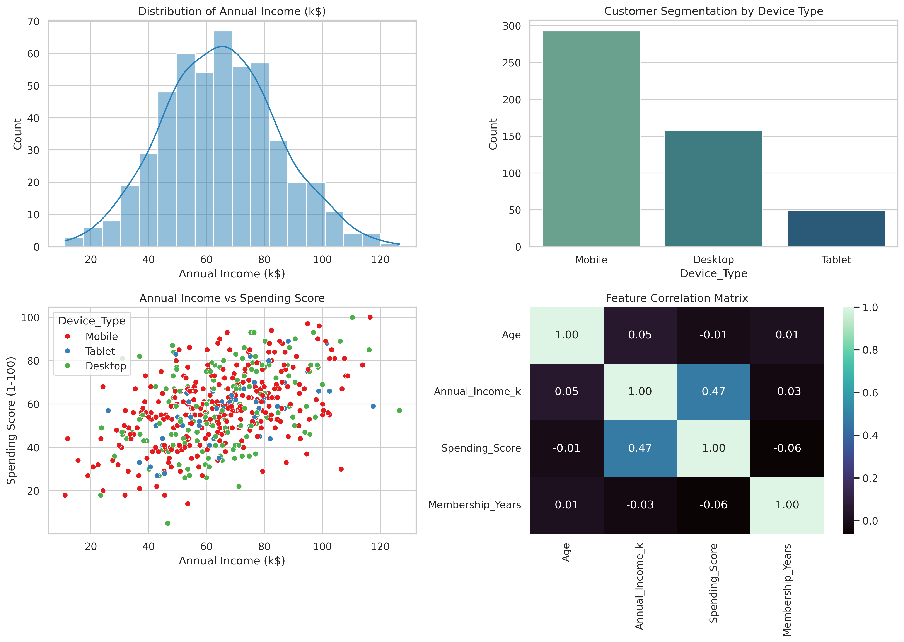

# thiranex-eda-project
Analyze a dataset to uncover patterns and trends.
# Exploratory Data Analysis (EDA) Project

## Executive Summary
This project performs an end-to-end Exploratory Data Analysis (EDA) on a consumer behavioral dataset to uncover core distributions, identify purchase trends, and pinpoint key factors driving customer spending.

## Statistical Summary
- **Income Distribution**: Annual earnings follow a standard normal profile centered around $65k.
- **Platform Usage**: Mobile transactions dominate customer activity (~60%), followed by desktop (~30%) and tablet (~10%).
- **Key Relationships**: Strong positive correlation identified between annual income and overall spending score.

## Visual Insights & Correlation Analysis

## Key Findings
1. **Income vs. Spending Elasticity**: Higher-earning segments demonstrate proportionally higher spending scores, marking them as the primary high-value cohort.
2. **Channel Optimization**: Marketing initiatives should prioritize mobile-first interfaces given user demographic concentration.
3. **Correlation Patterns**: Age and membership longevity show near-zero correlation with immediate spending behavior, confirming income as the primary predictive factor.

## Tech Stack
- Python
- Pandas, NumPy
- Matplotlib, Seaborn
